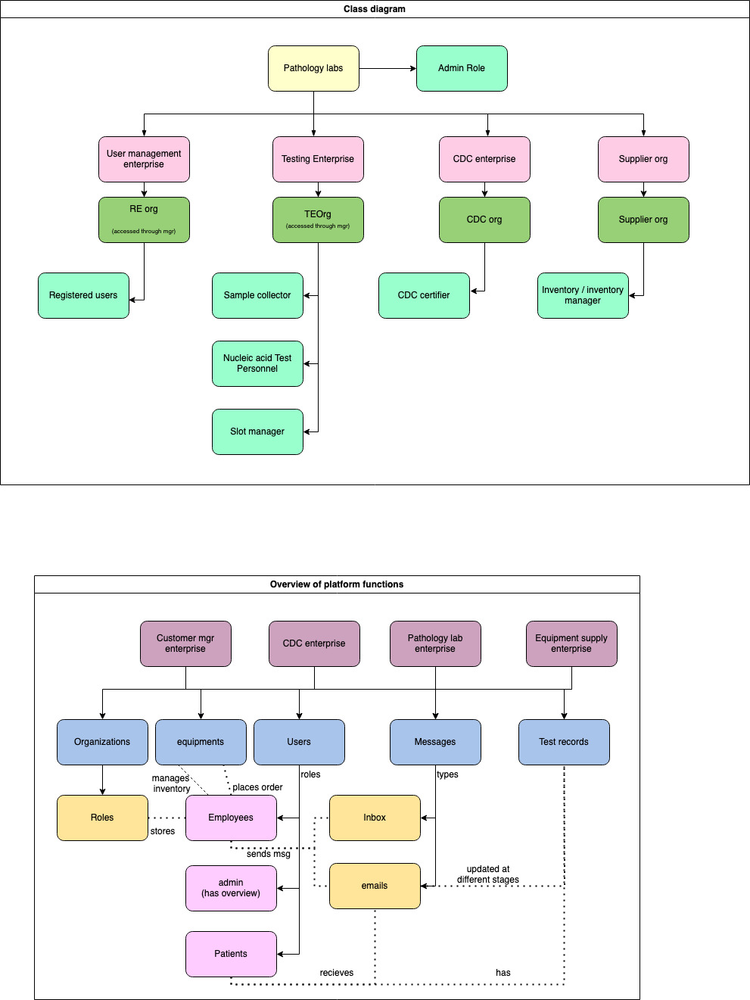

# Pathology and blood testing management platform

[presentation URL](https://docs.google.com/presentation/d/1ouxEe6vAiGGQrunYvVlHQuvWyT7RR7Hhlx2ZUEFcnzI/edit?usp=sharing)

# Class diagram

# Interaction diagram

# deliverables
1) A running swing application that addresses the challenges outlined aboveat an eco-system scale. A typical implementation must include the participation of at least 4 enterprises, 4-8 organizations, and 4-6 roles.
2) A presentation that outlines details specific to the design and implementation of your solution. This must include, the definition of the problem you solved, stakeholder and their contributions,use-cases, design, and implementation techniques followed. You must explain why each enterprise is essential to delivering the total value as outlined in your problem statement.
3) A robust role-based authentication module with strong user name and password capabilities.
4) A reporting module with summarized view of the data in your system. This could include performance data that is important at the system or network level.
5) A configuration module with test cases that will populate your model and show the correctness of your solution. You might want to integrate with a Faker module from faker.com for random data generation.

# Setup instructions
- add the jar files in (home)Libraries folder to the (blood-work)libraries within the bloodwork project for db4o and javax/mail
- clean and build the project again

## Roles

# Registered User
-Qwerty1 / Qwerty@123
- creates an appointment with platform for a blood test (chooses from four types of blood test)
- Tracks the status on their test and view past tests as well
# User/customer manager
-Qwerty2 / Qwerty@123
- Can see all registered users and appointment details with associated personnel
- Can delete / enable user
# Sample technician
-Qwerty3 / Qwerty@123
- Collects sample from user and updates user testing status
- clears the sample to be forwarded to lab
- Can place orders for equipments
- Updates workqueue
# Lab technician
-Qwerty4 / Qwerty@123
- Carries out test relevant and updates the status
- Can view past status
- Can place orders for equipments
- Updates workqueue
# Slot coordinator
-Qwerty6 / Qwerty@123
- Releases slots for new appointments
- Manages existing appointments
- Updates workqueue
# Site / employee manager
-Qwerty5 / Qwerty@123
- Manages employee from testing enterprise
# CDC
-Qwerty8 / Qwerty@123
- Approves the associated testing result
- Updates workqueue
# Inventory manager
-Qwerty10 / Qwerty@123
- Handles incoming orders from employees and fulfills them]
- Handles refilling inventory
# Admin
-Qwerty7 / Qwerty@123
- Has overview over appointment statuses and details
- Has overview over employees as well
